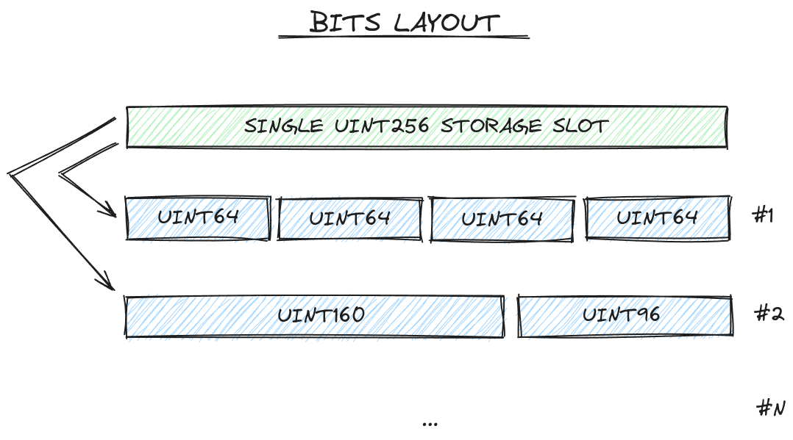
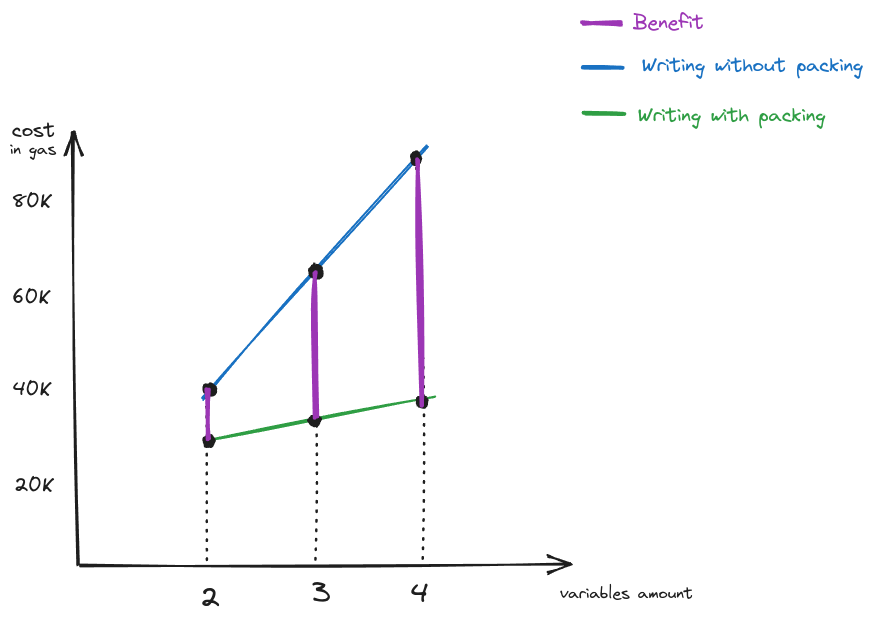

# Solidity Storage Optimizer

<p align="center">
  
</p>

## Overview
Solidity Storage Optimizer is a smart contract designed to help you efficiently store multiple values in a single storage slot. With gas costs directly tied to the amount of storage used, reducing the number of storage slots can lead to significant gas savings.

This project leverages bit-packing techniques to compress and store multiple variables into a single 256-bit storage slot. The primary use case is to optimize gas consumption in frequently used contracts where storage operations are a significant part of the cost.

## Features
- **Single Storage Slot packing:** Efficiently packs multiple small values into a single 256-bit storage slot.
- **Customizable Layouts:** Provides flexibility to define how many bits each value occupies within the storage slot.

## Efficiency

<p align="center">
  
</p>

### Writing without packing
| Variables Amount | Execution Cost (gas) |
| ---------------: | -------------------: |
|         2        |          44370       |
|         3        |          66484       |
|         4        |          88598       |

### Writing with packing (including arrays creating)
| Variables Amount  |Execution Cost (gas)| Benefit |
| ---------------- | ------------------ | ------: |
|  2	 	|   32274	| 27%  |
|  3 		|  34338 	| 48% |
|  4    |    36501 |  58%   |

### Build

```shell
$ forge build
```

### Run tests

```shell
$ forge test --gas-report
```
